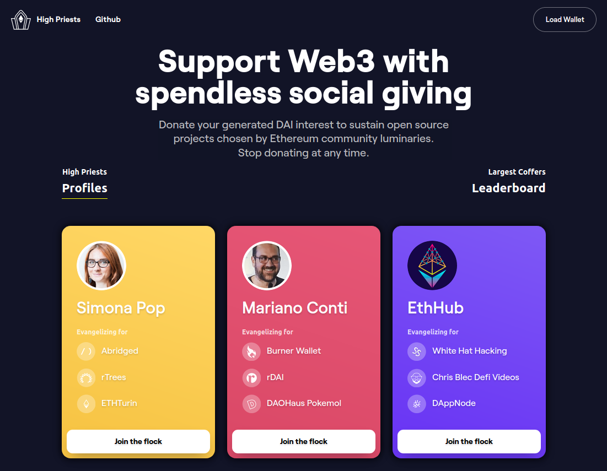

<h1 align="center">
  High Priests
</h1>



High Priests is <b>LIVE</b> at [https://highpriests.rdai.money](https://highpriests.rdai.money)

#### Made in under 24 hours with <3 @ ETH Denver 2020

🏆 Thank you to these awesome bounty prize sponsors: Maker, 3Box, and TheGraph

## 🚀 Quick start

This dapp can help you understand how to use the rDAI API ([https://api.rdai.money](https://api.rdai.money)). Note that the docs on the API site may be out of date. See the API repo ([link](https://github.com/rtoken-project/rtoken-contracts/tree/master/packages/api)) for the most up to date docs, and consider supporting open source with a PR!

> :warning: This app relies on "Dappy" for signing web3 transactions. Dappy is a closed-source package currently under development, and is purposefully ommited from this repo. If you're interested in working on Dappy, or just want to chat, then drop us a line! [https://dappy.dev](https://dappy.dev)

```shell
yarn start
# App starts running at http://localhost:8000
```

## Additional resources

[Awesome-Styled-Components](https://github.com/styled-components/awesome-styled-components)

[Gatsby documentation](https://www.gatsbyjs.org/docs/)
